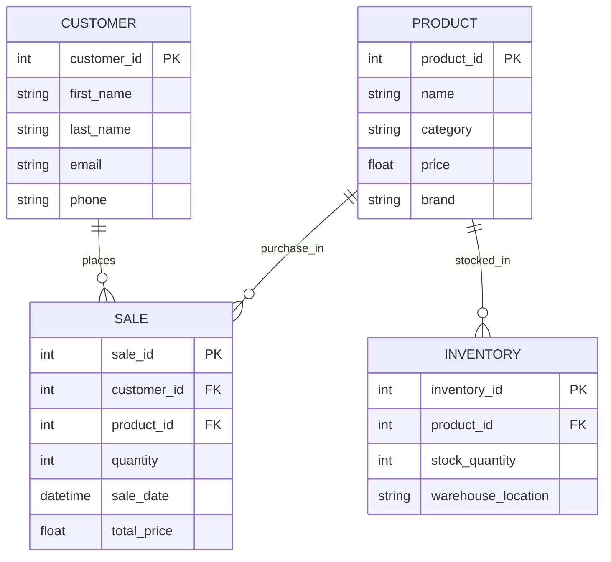

# Descriptions
1. PRODUCT - represents every model of Nike shoes sold in the store.
    - product_id PK: unique identifier for each product
    - name: name of the shoe
    - cateogy: type of shoe
    - price: cost of shoe
    - brand: type of brand 
2. CUSTOMER - represents every person who purchases the shoes.
    - customer_id PK: unique identifier for each customer
    - first_name: customers first name
    - last_name: customers last name
    - email: customers email
    - phone: customers phone/contact number
3. SALE - represents transaction details that link to customers and the product.
    - sale_id PK: unique identifier for each sale
    - customer_id FK: referencing the customer who made the purchase
    - product_id FK: referencing the product that was being purchased
    - quantity: number of products sold
    - sale_date: the date of the purchase
    - total_price: the total price of the sale that's calculated 
4. INVENTORY - tracking the stock levels on hand for each shoe model.
    - inventory_id PK: unique identifier for each inventory
    - product_id FK: referencing the product that is stocked
    - stock_quantity: number of products in stock
    - warehouse_location: location of the product
  
# Relationship & how it Supports Business Operations
1. CUSTOMER and SALE relationship displays that the customer can place several sales transactions but every sale will be linked to a single cusomter ID. This helps track a customers purchase hsitory so that we can then target them with personalized marketing and promotional emails or discounts.
2. PRODUCT and SALE relationship displays that every sale includes a product with a product ID and that product can be sold multiple times in multiple transactions. This helps see the trends of which product is in demand and track popular stocks, this would allow the store to be ahead of future purcahses for items that are trending.
3. PRODUCT and INVENTORY relationship displays that a product is available in inventory and its stock levels are tracked. This ensures that proper inverntory is kept in the warehouse, and reduces the chances of understocking or overstocking merchandise. 
